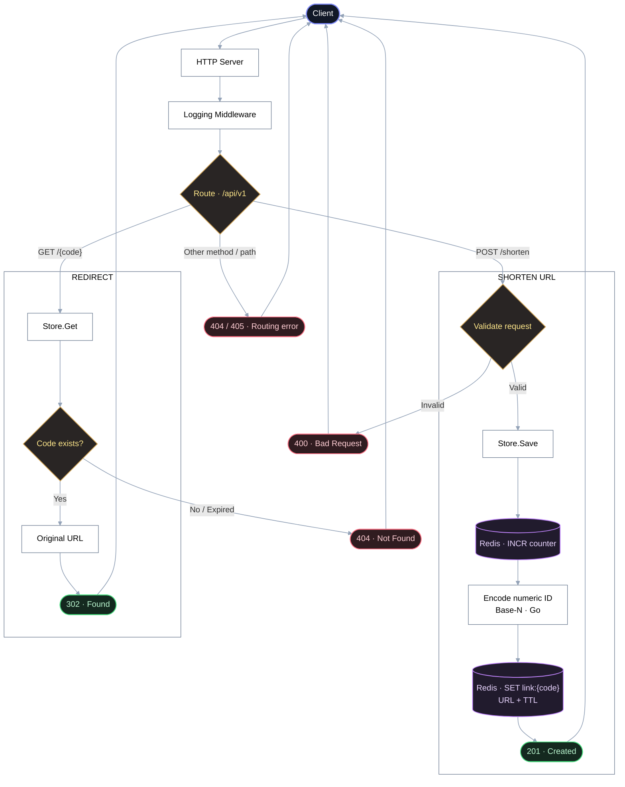

# Sortener

**A lightweight URL shortener built with Go and Redis.**

Sortener converts long URLs into short, Base-N encoded identifiers, stores them in Redis with a configurable time-to-live (TTL), and redirects visitors to their original destinations.

This document covers the architecture, technology stack, configuration, API, and testing strategy. For installation, environment setup, server execution, and troubleshooting, see **[HELP.md](HELP.md)**.

## Technology Stack

| Component         | Technology                       | Purpose                                        |
| ----------------- | -------------------------------- | ---------------------------------------------- |
| Language          | Go ≥ 1.26.9                      | Application runtime and HTTP server            |
| HTTP              | `net/http`                       | Standard library HTTP routing and handling     |
| Logging           | `log/slog`                       | Structured application logging                 |
| Storage           | Redis 7                          | ID counter, URL storage, and expiration        |
| Redis Client      | `redis/go-redis/v9`              | Redis connections, ACL authentication, and TLS |
| Configuration     | `joho/godotenv`                  | Load environment variables during development  |
| API Documentation | `swaggo/swag`, `http-swagger/v2` | Generate OpenAPI documentation and Swagger UI  |
| Testing           | `alicebob/miniredis/v2`          | In-memory Redis for isolated tests             |
| Packaging         | Docker multi-stage build         | Minimal, non-root runtime image                |
| CI/CD             | GitHub Actions                   | Dependency checks, testing, and deployment     |

## How It Works

1. **Submit a URL.** The client sends a `POST /api/v1/shorten` request containing a JSON payload of up to 1 KB.
2. **Validate the input.** The handler validates the request body and ensures the URL uses the `http` or `https` scheme and contains a valid host.
3. **Generate an identifier.** Redis `INCR` generates a unique, monotonically increasing numeric ID.
4. **Encode the identifier.** The ID is converted into a short code using the configured alphabet and a Base-N encoding algorithm.
5. **Store the URL.** The original URL is stored under `link:<code>` with a configurable TTL.
6. **Redirect visitors.** Requests to `GET /api/v1/{code}` resolve the stored URL and return an HTTP `302 Found` redirect.

Once a link expires, Redis removes its key automatically. Requests for expired or nonexistent codes return `404 Not Found`.

### Identifier Encoding

Sortener uses a configurable alphabet to encode numeric IDs into compact identifiers.

For example, with a base-62 alphabet:

`0123456789abcdefghijklmnopqrstuvwxyzABCDEFGHIJKLMNOPQRSTUVWXYZ`

| Numeric ID | Short Code |
| ---------: | ---------- |
|        `1` | `1`        |
|       `10` | `a`        |
|       `62` | `01`       |

The alphabet must contain unique characters. The encoding algorithm determines the representation of each ID based on the configured alphabet.

## Redis Data Model

| Key           | Type    | Description                                 | Lifetime         |
| ------------- | ------- | ------------------------------------------- | ---------------- |
| `counter`     | Integer | Generates monotonically increasing link IDs | Permanent        |
| `link:<code>` | String  | Stores the original URL                     | Configurable TTL |

The local development environment uses Redis with `appendonly yes` to persist data across container restarts.

The counter does not expire, while individual URL entries are automatically removed when their TTL elapses.

## Configuration

Sortener uses environment variables for all application configuration. Required values are validated during startup, and invalid or missing configuration causes the application to fail fast with a descriptive error.

The application also pings Redis during startup to verify connectivity and credentials before serving HTTP requests.

| Variable         | Required | Format                                        | Purpose                                           |
| ---------------- | :------: | --------------------------------------------- | ------------------------------------------------- |
| `ALPHABET`       |    Yes   | Unique character string                       | Defines the alphabet used to generate short codes |
| `TTL`            |    Yes   | Go duration, e.g. `720h`, `30m`               | Sets the lifetime of stored links                 |
| `REDIS_ADDR`     |    Yes   | `host:port`, `redis://...`, or `rediss://...` | Configures the Redis connection                   |
| `REDIS_USERNAME` |    No    | String                                        | Redis ACL username                                |
| `REDIS_PASSWORD` |    No    | String                                        | Redis authentication password                     |
| `BASE_URL`       |    No    | Public base URL                               | Determines the `short_url` response value         |
| `PORT`           |    No    | HTTP listen address                           | Configures the HTTP server address                |

Redis credentials embedded in the connection URL take precedence over the separate username and password variables.

For environment setup and deployment examples, see [HELP.md](HELP.md).

## API Reference

**Base path:** `/api/v1`

The API prefix is defined once in `router.go` and reused by the router and short URL generation logic.

| Method | Endpoint                     | Description                                  |
| ------ | ---------------------------- | -------------------------------------------- |
| `POST` | `/api/v1/shorten`            | Create a short URL                           |
| `GET`  | `/api/v1/{code}`             | Redirect to the original URL                 |
| `GET`  | `/api/v1/swagger/index.html` | Open the Swagger UI                          |
| `GET`  | `/api/v1/swagger/doc.json`   | Retrieve the generated OpenAPI specification |

### Create a Short URL

`POST /api/v1/shorten`

**Request**

```http
POST /api/v1/shorten
Content-Type: application/json

{
  "url": "https://example.com/a/very/long/path?query=value"
}
```

**Response — `201 Created`**

```json
{
  "code": "1",
  "short_url": "http://localhost:8080/api/v1/1"
}
```

**Response codes**

| Status                      | Description                                               |
| --------------------------- | --------------------------------------------------------- |
| `201 Created`               | The short URL was created successfully                    |
| `400 Bad Request`           | Invalid JSON, request body exceeding 1 KB, or invalid URL |
| `500 Internal Server Error` | An internal error occurred while accessing Redis          |

### Redirect to the Original URL

`GET /api/v1/{code}`

**Response — `302 Found`**

```http
HTTP/1.1 302 Found
Location: https://example.com/a/very/long/path?query=value
```

**Response codes**

| Status                      | Description                                               |
| --------------------------- | --------------------------------------------------------- |
| `302 Found`                 | The short code was resolved and the client was redirected |
| `404 Not Found`             | The code does not exist or has expired                    |
| `500 Internal Server Error` | An internal error occurred while accessing Redis          |

## Project Architecture

```text
sortener/
├── cmd/
│   ├── main.go
│   ├── store.go
│   ├── handler.go
│   ├── router.go
│   ├── store_test.go
│   ├── handler_test.go
│   └── router_test.go
├── docs/
│   ├── docs.go
│   ├── swagger.json
│   └── swagger.yaml
├── .github/
│   └── workflows/
│       ├── deps.yml
│       ├── test.yml
│       └── deploy.yml
├── Dockerfile
├── docker-compose.yaml
├── .dockerignore
├── .env.example
├── HELP.md
├── go.mod
└── go.sum
```

### Component Responsibilities

| File         | Responsibility                                                                                                      |
| ------------ | ------------------------------------------------------------------------------------------------------------------- |
| `main.go`    | Loads environment variables, initializes configuration and Redis, then starts the HTTP server                       |
| `store.go`   | Handles configuration, Redis connections, ID generation, Base-N encoding, URL storage, retrieval, and health checks |
| `handler.go` | Implements URL shortening and redirects, input validation, response types, and Swagger annotations                  |
| `router.go`  | Registers API routes, serves Swagger UI, defines the API prefix, and applies logging middleware                     |
| `*_test.go`  | Tests storage behavior, HTTP handlers, routing, and error cases                                                     |
| `docs/`      | Contains generated OpenAPI documentation embedded into the application binary                                       |

### Request Lifecycle



The application uses Go's standard `net/http` package and method-aware routing patterns. The handler and storage components have distinct responsibilities, keeping HTTP concerns separate from Redis operations.

## Testing

Sortener uses `miniredis` to run storage and handler tests without requiring a real Redis server.

Run the following commands to validate the codebase:

```bash
go vet ./...
go test -race -count=1 ./...
```

The test suite covers:

* Configuration parsing and validation, including missing and invalid values.
* Base N identifier encoding.
* Redis storage, retrieval, TTL handling, and expiration.
* Redis authentication, URL-embedded credentials, and TLS configuration.
* Request validation and HTTP response codes.
* End to end shortening and redirect behavior.
* Routing, API prefixes, unsupported methods, and Swagger endpoints.

## Continuous Integration and Deployment

GitHub Actions automates dependency verification, testing, and deployment.

| Workflow     | Trigger                                      | Responsibilities                                                               |
| ------------ | -------------------------------------------- | ------------------------------------------------------------------------------ |
| `deps.yml`   | Dependency file changes and scheduled checks | Reports outdated dependencies, verifies modules, and runs `govulncheck`        |
| `test.yml`   | Pushes to `master` and pull requests         | Runs `go vet`, race-enabled tests, and coverage reporting                      |

The Docker image uses a multi-stage build to produce a minimal runtime image based on `scratch`, with a non-root user and the CA certificates required for secure connections.

## License

Sortener is licensed under the **MIT License**.
